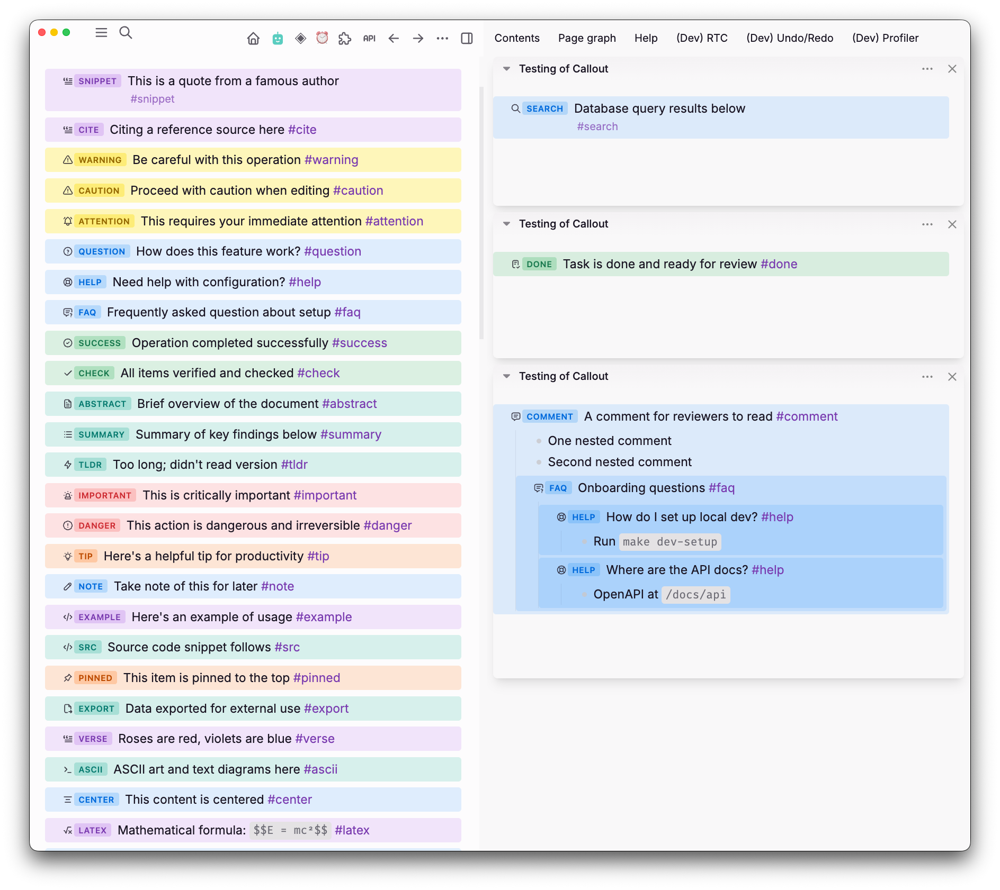
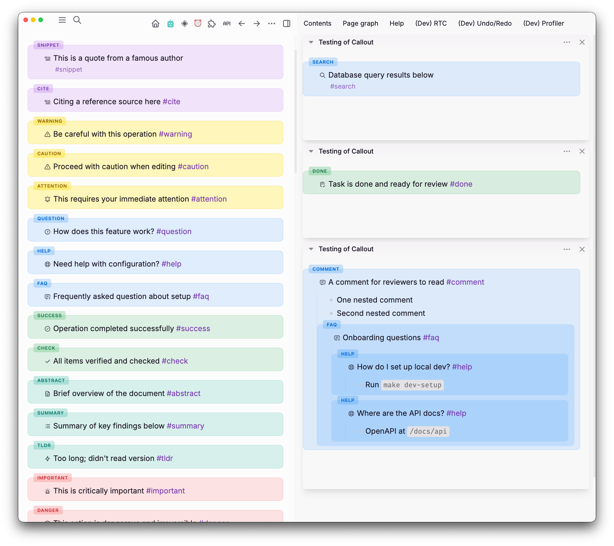
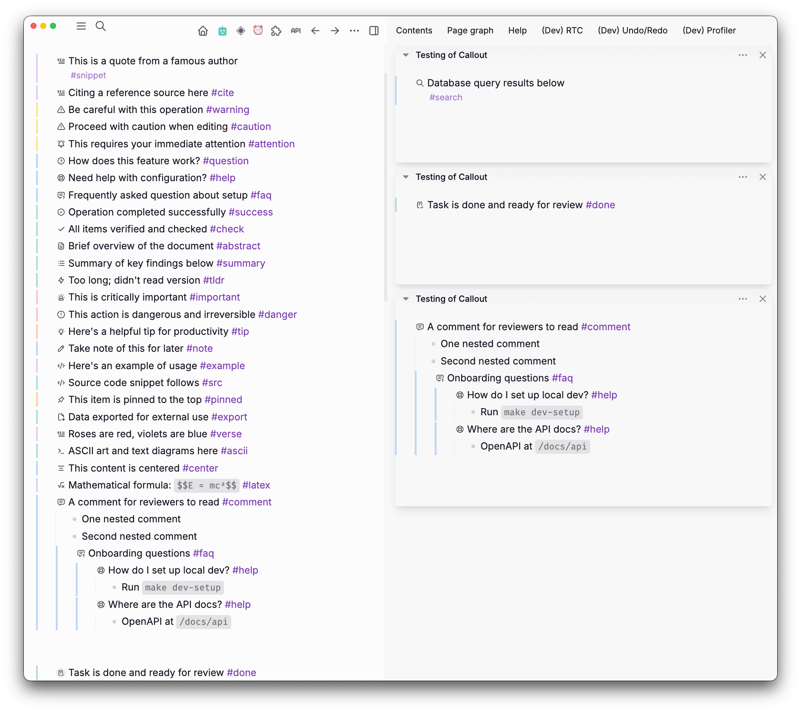
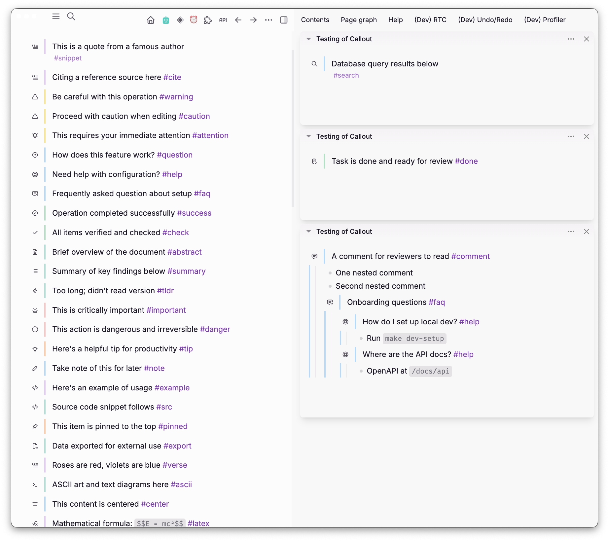

# Callout Manager

Tag-driven callout styling for Logseq blocks — icons, labels, and colored backgrounds with nested visual hierarchy. Four display modes (inline, container, icon, admonition), 28 predefined tags across 7 color groups, with optional cascade-to-children.

> **DB graphs only** (`supportsDBOnly: true`)



## Usage

Add a callout tag as an inline ref in any block (e.g. `#warning`, `#tip`, `#question`). The plugin detects the tag and applies visual styling automatically.

### Supported Tags

| Tag          | Label     | Icon             | Color  |
| ------------ | --------- | ---------------- | ------ |
| `#snippet`   | Snippet   | quote            | purple |
| `#cite`      | Cite      | blockquote       | purple |
| `#warning`   | Warning   | alert-triangle   | yellow |
| `#caution`   | Caution   | alert-triangle   | yellow |
| `#attention` | Attention | bell-ringing     | yellow |
| `#question`  | Question  | help-circle      | blue   |
| `#help`      | Help      | lifebuoy         | blue   |
| `#faq`       | FAQ       | message-question | blue   |
| `#success`   | Success   | circle-check     | green  |
| `#check`     | Check     | check            | green  |
| `#done`      | Done      | checklist        | green  |
| `#abstract`  | Abstract  | file-text        | teal   |
| `#summary`   | Summary   | list             | teal   |
| `#tldr`      | TLDR      | bolt             | teal   |
| `#important` | Important | urgent           | red    |
| `#danger`    | Danger    | alert-octagon    | red    |
| `#tip`       | Tip       | bulb             | orange |
| `#note`      | Note      | pencil           | blue   |
| `#example`   | Example   | code             | purple |
| `#src`       | Src       | code             | teal   |
| `#search`    | Search    | search           | blue   |
| `#latex`     | LaTeX     | math             | purple |
| `#pinned`    | Pinned    | pin              | orange |
| `#export`    | Export    | file-export      | teal   |
| `#verse`     | Verse     | blockquote       | purple |
| `#ascii`     | Ascii     | terminal         | teal   |
| `#center`    | Center    | align-center     | blue   |
| `#comment`   | Comment   | message          | blue   |

### Display Modes

#### Inline (default)

Colored background band with icon + label badge inline on the bullet line.


#### Container

Each callout block wrapped in a bordered, tinted box with a floating uppercase badge above. Children blocks merge into the same box.



#### Icon

GitHub-style colored left border and the native Logseq node icon (set via `Editor.setBlockIcon`). Lighter than the other modes; useful when you want minimal styling.



#### Admonition

Minimal Asciidoctor-style: a vertical accent bar between the bullet column and the content, paired with the native block icon. No background tint, no font-size shift. Cascade extends the bar through nested child blocks.



### Settings

| Setting             | Default | Description                              |
| ------------------- | ------- | ---------------------------------------- |
| Display Mode        | inline  | How callout tags are displayed           |
| Cascade to Children | true    | Apply styling to child blocks            |
| Show Label          | true    | Show callout type label (e.g. "Warning") |
| Show Icon           | true    | Show tabler icon on the block            |

Slash commands are registered for all 28 callout types (e.g. `/Callout: Warning`). Using a slash command also sets the node icon.

## Development

```bash
pnpm install     # Install dependencies
pnpm build       # Production build → dist/
pnpm watch       # Rebuild on file changes
pnpm dev         # Vite dev server at http://localhost:8080 (HMR + plugin auto-reload)
pnpm typecheck   # TypeScript type check
```

Load in Logseq: Settings → Advanced → Developer mode → Plugins → "Load plugin from web url" → `http://localhost:8080`

## Privacy

All processing is local. The plugin reads blocks on the active page through the Logseq SDK and injects CSS into the host document — it makes no network requests and stores no data outside Logseq.

## License

MIT
